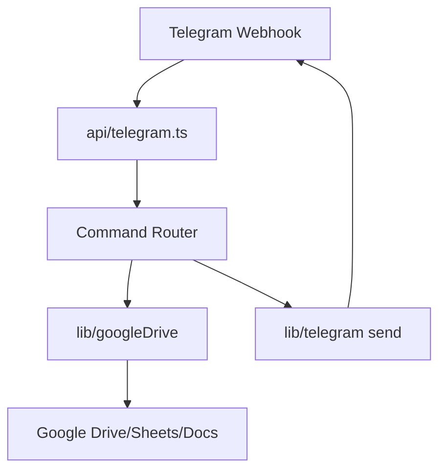
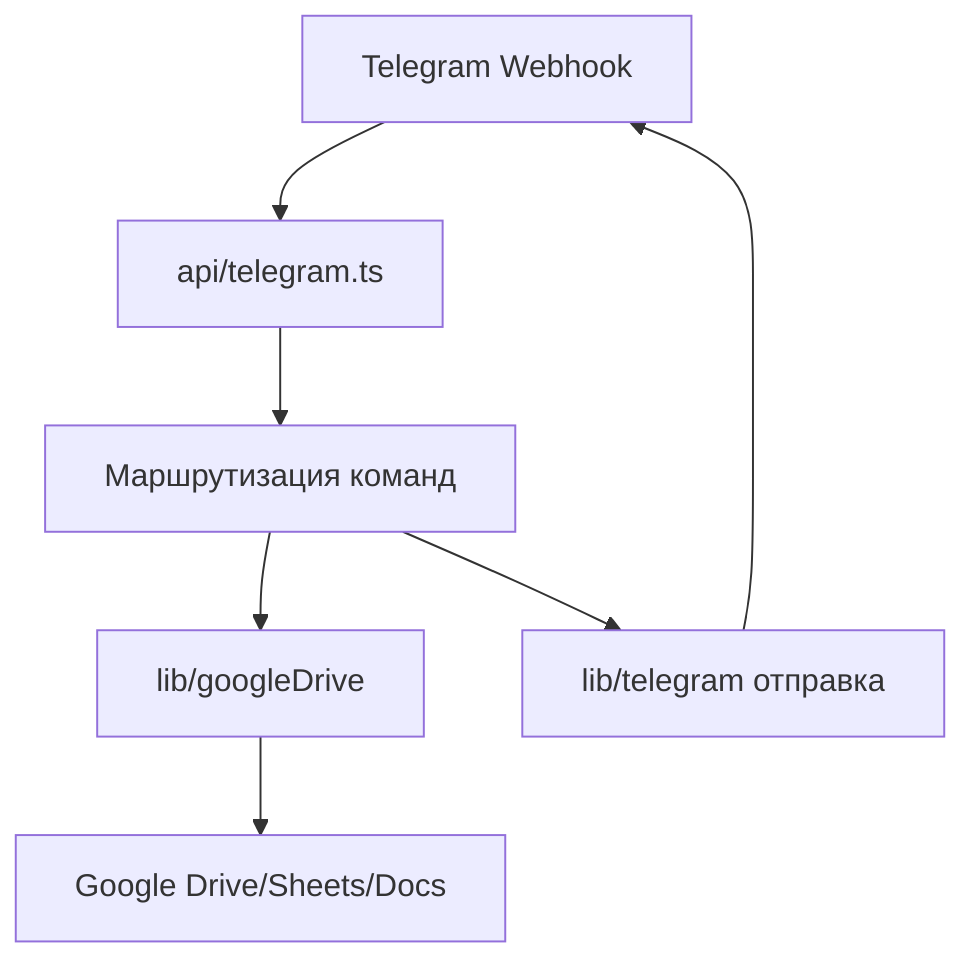

# Worker Reports Telegram Bot
[](https://github.com/DenisArger/work-reports/actions/workflows/ci.yml)

## English

## Problem
Managers need periodic report aggregation from Google Sheets, but collecting files and summaries manually is slow and error-prone.

## Solution
This Telegram bot receives commands, collects report spreadsheets from Google Drive, and returns structured summaries (including document generation flows).

## Tech Stack
- Node.js 20+
- TypeScript
- Telegram Bot API (Vercel function handlers)
- Google APIs (`googleapis`)
- Vercel

## Architecture
Top-level structure:
```text
api/
  telegram.ts
  health.ts
lib/
scripts/
vercel.json
package.json
```



## Features
- Telegram commands for report operations (`/reports`, `/today`, etc.)
- Aggregation from Google Drive spreadsheets
- Summary document generation flows
- Admin-only command restrictions and update dedup support

## How to Run
```bash
yarn install
cp .env.example .env
yarn dev
```

Deploy/build helpers:
```bash
yarn build
yarn build:vercel
```

## Русский

## Проблема
Руководителям нужна регулярная сводка отчетов из Google Sheets, а ручной сбор файлов и подготовка итогов занимает много времени и дает ошибки.

## Решение
Бот принимает команды в Telegram, собирает таблицы отчетов из Google Drive и возвращает структурированные сводки (включая генерацию документов).

## Стек
- Node.js 20+
- TypeScript
- Telegram Bot API (handlers как Vercel функции)
- Google APIs (`googleapis`)
- Vercel

## Архитектура
Верхнеуровневая структура:
```text
api/
  telegram.ts
  health.ts
lib/
scripts/
vercel.json
package.json
```



## Возможности
- Telegram-команды для отчетов (`/reports`, `/today` и др.)
- Агрегация данных из Google Drive таблиц
- Формирование сводного документа
- Ограничение админ-доступа и дедупликация апдейтов

## Как запустить
```bash
yarn install
cp .env.example .env
yarn dev
```

Полезные команды сборки/деплоя:
```bash
yarn build
yarn build:vercel
```
